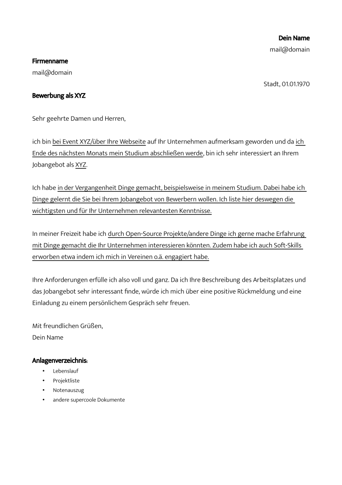
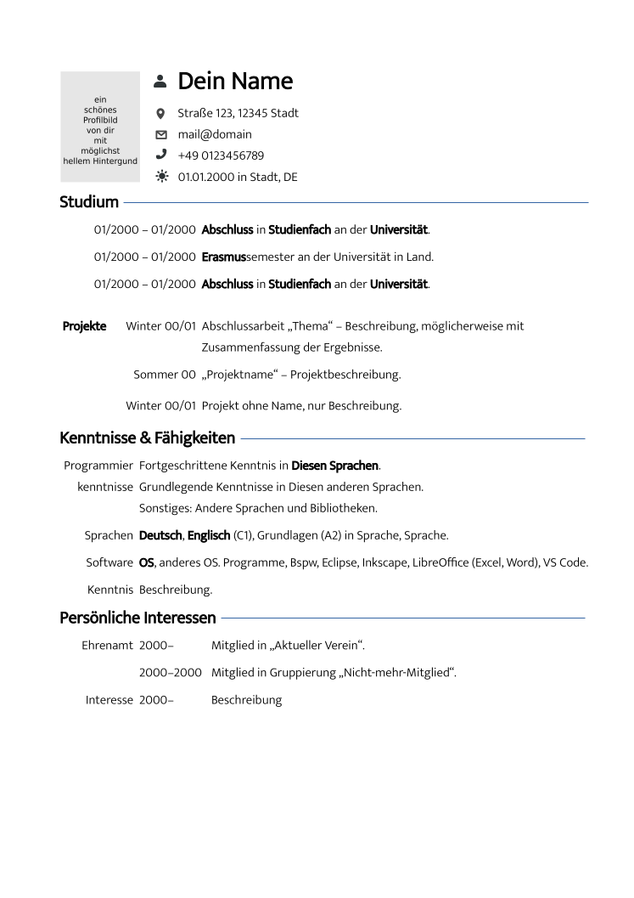
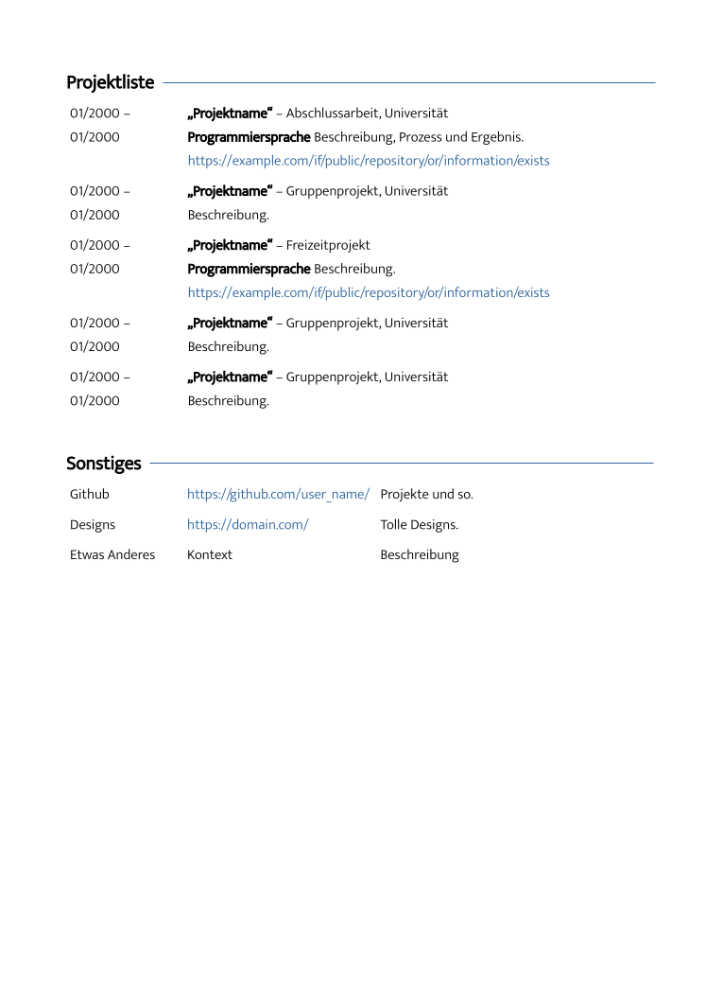

Bewerbung
=========
This contains a bunch of .odt template files that I made to apply to companies.
They are in German and very simplistic.

The font used is [Mukta](https://fonts.google.com/specimen/Mukta).
It can currently not be included because of a 
[LibreOffice bug](https://bugs.documentfoundation.org/show_bug.cgi?id=35574)
Thus the fonts need to be installed for the templates to be displayed correctly.
For Linux that can for example be achieved by downloading and extracting the
`.zip` file and moving the extracted `.ttf` files to the hidden `.fonts` folder
in your home directory.

[Anschreiben / cover note](Anschreiben.pdf)

[Lebenslauf / CV](Lebenslauf.pdf)

[Projektliste / list of projects](Projektliste.pdf)

The Profile picture of the 'Lebenslauf' is 696 x 946 pixels.
You can scale and trim your own picture for example by using
[the .svg template](src/Profilbild.svg) with e.g.
[Inkscape](https://inkscape.org/).

